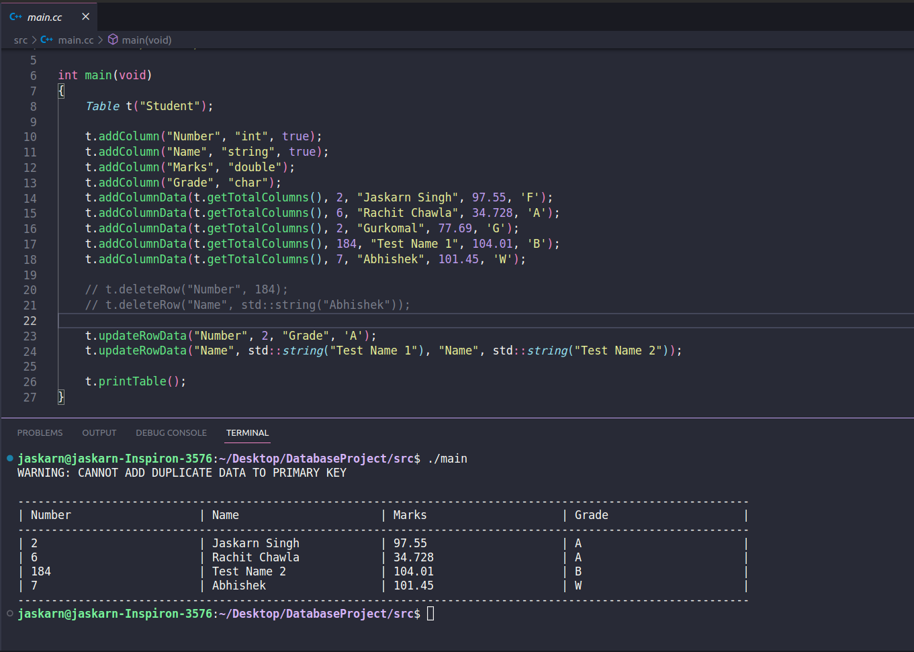

# Overview
In this project, we tried to implement a database system in C++ programming language written from scratch!  

# Compiling and Executing
To compile the program, go to root directory of the project and enter the following command in the terminal:  
```
g++ -Wall -std=c++17 -o main ./src/Column.cc ./src/Table.cc ./src/main.cc
```
Then an executable file named `main` will be create in the root directory of the project.  
Run the Program by executing the `main` file:
```
./main
```
# Example
